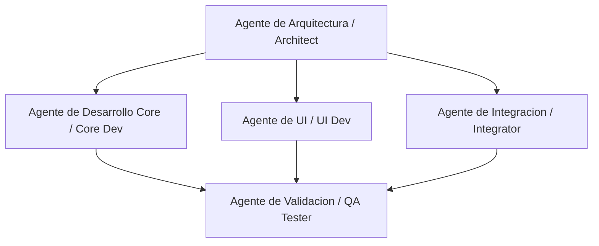

# Multi-Agent Step-by-Step Implementation Plan: Odoo IoT Migration to Flutter

This plan details the full migration of Odoo's IoT system (core interfaces, drivers, WebSocket client connection, Windows printer scanning, COM port scanning, and owl-based UI) to the Flutter desktop application (`OdooDesktopSync`).

---

## 👥 Multi-Agent Team & Roles

### 1. Agente de Arquitectura (Architect Agent)
- **Role:** Designs systems, type safety, registry patterns, and interface models.
- **Tasks:**
  - Structure the registry for drivers to register dynamically without reflection.
  - Define abstraction signatures for `IoTDriver`, `IoTInterface`, and `IoTManager`.
  - Design the WebSocket communication handler.
  - Design the Windows system command integration for device enumeration.

### 2. Agente de Desarrollo Core (Core Developer Agent)
- **Role:** Implements backend code, WebSocket socket loop, device registry, and hardware listings.
- **Tasks:**
  - Implement `iot_driver.dart`, `iot_interface.dart`, `iot_manager.dart`.
  - Implement `websocket_client.dart` in Dart using native `dart:io` `WebSocket`.
  - **Windows Device Enumeration:**
    - **Printer Scanner:** Execute PowerShell `Get-Printer | Select-Object Name, PortName | ConvertTo-Json` in `PrinterInterface` to list local print queues, filtering out virtual printers (e.g. `PORTPROMPT:`).
    - **Serial Scanner:** Execute PowerShell `[System.IO.Ports.SerialPort]::GetPortNames()` in `SerialInterface` to list all COM ports.
  - Implement concrete Drivers:
    - **PrinterDriver:** For connected local printers. Handles raw text actions.
    - **ScaleDriver:** For serial COM ports. Periodically polls scale weight.

### 3. Agente de UI (UI Developer Agent)
- **Role:** Builds pixel-perfect user interface mimicking Odoo's OWL-based IoT Box Status Page.
- **Tasks:**
  - Code the Flutter dashboard layout matching Odoo Purple (`#714B67`), Teal (`#017E84`), and Gray background (`#F1F1F1`).
  - Implement list elements (`SingleData` widgets) with proper Odoo-style icons (FontAwesome/Material equivalents).
  - Implement advanced settings toggle, certificate warning alert, and dialog actions (Wi-Fi config mockup, database connection dialog, device list dialog).

### 4. Agente de Integración (Integrator Agent)
- **Role:** Connects services, manages provider injections, and routes HTTP requests.
- **Tasks:**
  - Wire the WebSocket client, HTTP controllers, and IoT Manager to the Riverpod state tree.
  - Add `/iot_drivers/action` and `/iot_drivers/event` endpoints to `api_server.dart` for Odoo JSON-RPC compatibility.
  - Initialize the IoT Manager, register printer and serial drivers, and start interfaces inside `main.dart`.

### 5. Agente de Validación (QA Validator Agent)
- **Role:** Code audits, compiler checks, functionality tests, and pixel-matching verification.
- **Tasks:**
  - Verify compile checks and clean code linting.
  - Audit Windows printer/COM command execution outputs.
  - Validate that the UI complies with the Odoo IoT Status Page specification.

---

## 📋 Step-by-Step Implementation Flow

### Phase 1: Core IoT Architecture & Windows Listings (Architect & Core Dev Agents)
1. **Create [iot_driver.dart](file:///D:/Documentos/Proyectos/Flutter/OdooDesktopSync/lib/core/iot/iot_driver.dart):** Base class for Odoo-like drivers. Exposes properties (`device_type`, `device_name`, `device_manufacturer`, `device_connection`) and `executeAction(actionName, data)`.
2. **Create [iot_interface.dart](file:///D:/Documentos/Proyectos/Flutter/OdooDesktopSync/lib/core/iot/iot_interface.dart):** Loop-based hardware scanner. Computes device additions/removals and handles driver binding.
3. **Create [iot_manager.dart](file:///D:/Documentos/Proyectos/Flutter/OdooDesktopSync/lib/core/iot/iot_manager.dart):** Central Registry. Stores active drivers, registers new ones, handles long polling requests (`waitForEvent`).
4. **Create [websocket_client.dart](file:///D:/Documentos/Proyectos/Flutter/OdooDesktopSync/lib/core/iot/websocket_client.dart):** Connects to `ws://{server_url}/websocket`, logs in to retrieve standard `session_id` cookies, listens for `iot_action` events, and dispatches actions to drivers.

### Phase 2: Windows System Drivers & Interfaces (Core Dev Agent)
1. **Create [printer_interface.dart](file:///D:/Documentos/Proyectos/Flutter/OdooDesktopSync/lib/core/iot/interfaces/printer_interface.dart):**
   - Implements `IoTInterface` for type `printer`.
   - Runs `powershell -Command "Get-Printer | Select-Object Name, PortName | ConvertTo-Json"` to list local print queues.
   - Ignores virtual ones (e.g. `PORTPROMPT:`).
   - Maps each print queue to a printer device description.
2. **Create [serial_interface.dart](file:///D:/Documentos/Proyectos/Flutter/OdooDesktopSync/lib/core/iot/interfaces/serial_interface.dart):**
   - Implements `IoTInterface` for type `serial`.
   - Runs `powershell -Command "[System.IO.Ports.SerialPort]::GetPortNames()"` to get active COM ports on Windows.
3. **Create [printer_driver.dart](file:///D:/Documentos/Proyectos/Flutter/OdooDesktopSync/lib/core/iot/drivers/printer_driver.dart):**
   - Binds to `printer` interfaces.
   - Registers itself to print text payloads via standard print mechanisms.
4. **Create [scale_driver.dart](file:///D:/Documentos/Proyectos/Flutter/OdooDesktopSync/lib/core/iot/drivers/scale_driver.dart):**
   - Binds to `serial` COM interfaces.
   - Simulates serial scale weight polling or listens to port updates, updating data values (`value: X.XX kg`) and dispatching events.

### Phase 3: Shelf HTTP Server Routing (Integrator Agent)
1. **Modify [api_server.dart](file:///D:/Documentos/Proyectos/Flutter/OdooDesktopSync/lib/api_server.dart):** Add the following endpoints:
   - `POST /iot_drivers/action`: Decodes standard JSON-RPC 2.0 messages from Odoo, resolves the driver, and executes actions.
   - `POST /iot_drivers/event`: Supports long polling by listening to `IoTManager.waitForEvent`.
2. **Modify [dependency_providers.dart](file:///D:/Documentos/Proyectos/Flutter/OdooDesktopSync/lib/core/providers/dependency_providers.dart):** Expose `IoTManager` and `WebSocketClient` providers.

### Phase 4: UI Development - Odoo Status Page Clone (UI Dev Agent)
1. **Modify [dashboard_screen.dart](file:///D:/Documentos/Proyectos/Flutter/OdooDesktopSync/lib/ui/screens/dashboard_screen.dart):** 
   - Render a centered Card (max-width `600px`) over a `#F1F1F1` background.
   - Match Odoo styling (Purple `#714B67` for buttons, `#017E84` for info/teals, white cards).
   - Implement `SingleData` rows showing:
     - Identifier / Mac Address
     - System Version
     - Local IP Address
     - Internet Status (Wi-Fi/Ethernet)
     - Odoo Database URL (with dynamic Connection status badge)
     - Active Devices count (clicking opens a dialog displaying connected drivers list).
   - Display a warning banner if no Odoo database certificate is configured.
   - Add top-right Cog & Power buttons to toggle advanced views and shutdown services.
   - Add footer buttons styled exactly like Odoo's status page.

### Phase 5: Verification & QA (QA Validator Agent)
1. Run compilation checks and fix syntax lints.
2. Run manual tests by simulating mock scale events to verify UI/console state updates.

---

## 🔍 Validation Checklist (QA Validator Agent)

| Checkpoint | Validation Method | Expected Outcome | Status |
| :--- | :--- | :--- | :--- |
| **Dart Compilation** | Run `flutter pub get` | No build errors, clean package import. | Pending |
| **Printer Discovery** | Trigger scan, check PowerShell output | Discovers Windows system printers, discards virtual ports. | Pending |
| **COM Port Discovery** | Trigger scan, check PowerShell output | Discovers COM ports dynamically on Windows. | Pending |
| **Driver Registration** | Start the app and audit logs | `IoTManager` finds and registers drivers with priority sorting. | Pending |
| **Odoo WebSocket Connection** | Monitor console logs on start | Connects, handles session cookie login, and subscribes to channel. | Pending |
| **JSON-RPC Actions** | Call `/iot_drivers/action` | Shelf router executes the matching driver method and returns RPC response. | Pending |
| **UI Aesthetics Matching**| Visual comparison | Center card layout, Odoo purple theme, warning banner, and OWL-like footer buttons. | Pending |
